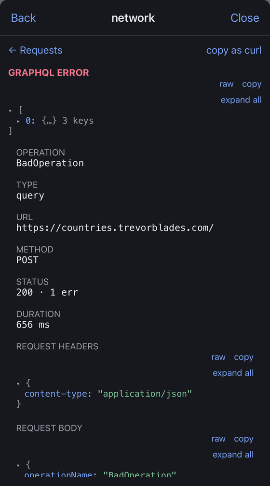
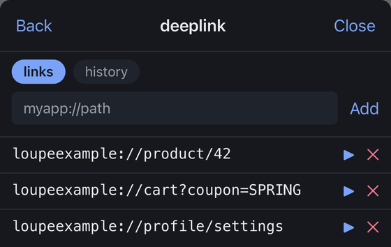

<div align="center">

# Loupe

**An on-device debug overlay.**
Network, logs, storage, and deep links — inspected inside the app you are
building. No desktop client, no cable.

[](https://www.npmjs.com/package/react-native-loupe)
[](LICENSE)
[](packages/react-native)

</div>

## Quick start

```sh
npm install --save-dev react-native-loupe
```

Add one line as the **first line** of `index.js`:

```js
import 'react-native-loupe';
```

That is the whole setup for the network, log, and deep link panels. A draggable
bubble appears, and release builds ship none of it — everything sits behind
`__DEV__` and Metro strips it from production bundles.

Storage and shake each need one more line, because Loupe will not reach for a
package you might not have installed. See the
[package README](packages/react-native/README.md#optional-backends).

## The panels

**Network** — requests with body, headers and timing.

GraphQL is a first-class citizen, because an app that speaks GraphQL `POST`s
everything to one URL and every row otherwise reads the same. Rows are titled by
**operation name** with a `QRY` / `MUT` / `SUB` label, and filtering matches the
operation. **Copy as curl** rebuilds any request as a runnable command, with
credentials redacted by default.

A GraphQL failure is an HTTP `200`. A status-code-only view shows a *failed*
operation as a green success — the most misleading thing a network panel can do
for this kind of app. So a response carrying an `errors` array reads
`200 · 1 err` in the error colour, and the detail view leads with the errors
instead of burying them:

<p align="center">
  
</p>

**Storage** — whatever backends you hand it, editable in place, filterable by
key, with destructive actions confirm-gated. Values that parse as JSON render as
a collapsible tree with a `raw` toggle for the exact bytes.

An adapter can mark itself `sensitive`, and the Keychain adapter does. Its values
stay masked until you tap to reveal one, and copy stays hidden until then. These
are auth tokens, and a dev build gets screen-shared in standups.

**Logs** — every `console` call, filtered to a minimum level and by message text.
Entries at error level carry a stack. When the ring buffer drops old entries to
stay inside its budget, the panel says how many it dropped rather than quietly
showing you a shorter list.

**Deep links, both directions** — keep a list of links you can fire from inside
the app, and see every link the app *receives*, including the one that
cold-started it. A link you fired and its arrival sit next to each other on one
timeline, so you can tell whether a redirect actually landed. Needs nothing
installed; `Linking` ships with React Native.

<p align="center">
  
</p>

Not enough? The four built-ins are registered through the same public
`registerTool` API you can use, and your events land in the same ring buffer.

## Three implementations, one contract

| Slice                     | Status                   |
| ------------------------- | ------------------------ |
| React Native / TypeScript | v0                       |
| iOS / Swift               | planned                  |
| Android / Kotlin          | planned                  |

The contract lives in `packages/contract` as wire types and JSON fixtures each
implementation must round-trip, so "the three agree" is a test rather than an
intention.

## Packages

- **`packages/contract`** — wire types and conformance fixtures.
- **`packages/core`** — EventBus and ring buffer. Pure TypeScript, no React or
  React Native imports, so the native ports have a reference to mirror.
- **`packages/react-native`** — [`react-native-loupe`](packages/react-native/README.md).
  Capture, overlay, and the four built-in panels.

## Development

```sh
pnpm install
pnpm test              # every package
pnpm typecheck         # strict TypeScript across the workspace
pnpm verify:release    # proves release builds ship no Loupe code
pnpm verify:peers      # proves no module name reaches Metro as a variable
pnpm verify:absent     # proves Loupe requires no package the host may not have
```

The three `verify:*` scripts exist because each guards something no unit test
can observe. They check a real Metro bundle, or the library's source, for
properties that are invisible under jest — every one of them was added after a
bug that shipped with a green suite.

The screenshots above come from `example/`, a dogfood app that exercises every
panel against live traffic. See [its README](example/README.md) to run it.

## Contributing

Issues and pull requests are welcome — see [CONTRIBUTING.md](CONTRIBUTING.md).

## License

MIT © Amanda Gama
